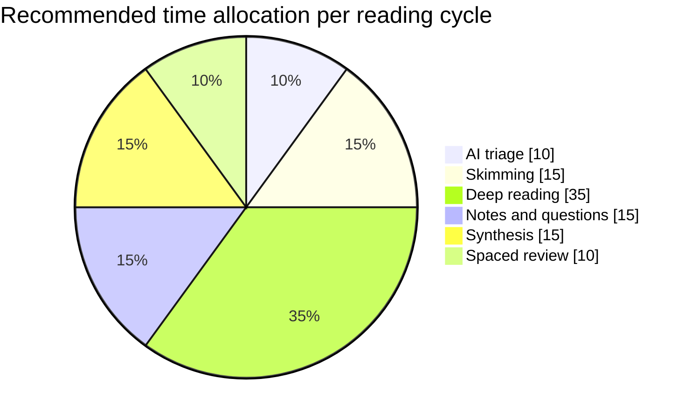
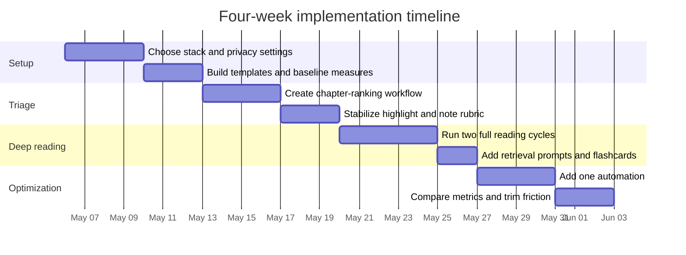

# Reading Effectively with AI

## Executive summary

AI changes the economics of reading most at the *edges* of the process: deciding what deserves attention before you read, and consolidating what matters after you read. It is much less reliable as a substitute for the middle of the act of reading itself. That is especially true for high-stakes, cumulative, or stylistically rich books, because long-context models still show positional bias, and AI summaries can omit or distort nuance through factual inconsistency or overgeneralization. In practice, that means the safest default is **AI for triage and review; human reading for judgment and interpretation**. citeturn15view3turn15view2turn31search1

The empirical picture is mixed but useful. Recent studies suggest that AI-based scaffolds can help some readers, including lower-performing readers and some second-language learners, yet static AI summaries alone often do **not** improve retention or transfer and can even worsen outcomes for stronger readers. The most defensible use of AI is therefore not “read the book for me,” but “help me decide, question, compare, rehearse, and retrieve.” citeturn15view0turn15view1turn28view2turn37view0

The highest-confidence workflow is a hybrid one: use AI for pre-read triage, chapter ranking, terminology help, question generation, note normalization, and spaced review; keep humans responsible for source verification, quote checking, structural interpretation, and final synthesis. That recommendation aligns with the strongest learning evidence, which still favors retrieval practice, spacing, self-explanation, and learning-by-teaching over passive rereading or passive summary consumption. citeturn26view0turn15view4turn28view0turn28view1

## Goals and decision rules

Different reading goals justify different AI roles. Academic reading prioritizes citation fidelity and argument structure. Professional reading prioritizes decision usefulness and speed. Leisure reading prioritizes voice, surprise, interpretation, and affect. Those differences should determine how much of the book you actually read, and what work you outsource to AI. The table below is a practical synthesis of the evidence and the official-tool constraints reviewed for this report. citeturn15view3turn15view2turn31search1turn15view0turn15view1turn26view0

| Use case | Primary goal | Best default mode | Best AI role | What the human must still do | Typical deliverable |
|---|---|---|---|---|---|
| Academic | Understand and cite accurately | Full read or hybrid | Triage, concept maps, question generation, note cleanup, review cards | Read the core chapters, verify claims against source, preserve quotations and page references | Citation-ready notes, argument map, literature memo |
| Professional | Extract decisions and relevant evidence fast | Selective or hybrid | Rank chapters, pull action items, compare frameworks, convert notes into briefs | Check the chapters that affect real decisions, inspect caveats and exceptions | Decision memo, risk log, meeting brief |
| Leisure nonfiction | Learn ideas without over-investing | Selective or hybrid | Identify “high-yield” chapters, distill repeated points, generate reflection prompts | Read the parts that feel novel, useful, or enjoyable | Short reflection note, 3–5 takeaways |
| Literary fiction | Preserve voice, pacing, ambiguity, and theme | Full read | Spoiler-safe prompts, motif tracking, close-reading questions, character map *only from read chapters* | Read the text itself, not a substitute summary; interpret sentences and scenes firsthand | Reading journal, motif map, discussion questions |

A practical scoring rule works better than intuition alone. Score each criterion from 0 to 2. Then choose the reading mode that matches the total.

| Criterion | 0 | 1 | 2 |
|---|---|---|---|
| Cost of being wrong | Low | Moderate | High |
| Need to quote, cite, teach, or defend interpretation | Rarely | Sometimes | Frequently |
| Book depends on cumulative structure or pacing | Low | Medium | High |
| Style, voice, or rhetoric are part of the value | Low | Medium | High |
| Expected redundancy | High | Mixed | Low |
| Deadline pressure | None | Moderate | Severe |

**Scoring rule:**  
**8–12** = full read.  
**5–7** = hybrid read.  
**0–4** = selective read.

Two overrides matter. First, literary fiction, poetry, memoir, and philosophically dense prose should usually get an automatic bump toward full reading because summaries flatten tone, pacing, and ambiguity. Second, any work you will cite in formal writing, rely on for a consequential decision, or use to teach others should also move toward full or hybrid reading because summary drift and overgeneralization remain real failure modes. citeturn15view3turn31search1turn15view2turn33view0

## Workflow

The workflow below is designed to preserve the advantages of AI without surrendering judgment to it. The central design principle is simple: **AI should reduce search costs, not replace contact with the source.** When in doubt, feed the model a chapter, section, or passage, not the entire book, and ask it to separate *what the text says* from *what it infers*. That approach directly addresses long-context weakness and summary bias. citeturn15view3turn15view2turn31search1

| Phase | Human action | AI action | Output | Stop condition |
|---|---|---|---|---|
| Pre-read triage | Gather title, subtitle, author bio, table of contents, preface, index, blurbs, and your purpose for reading | Infer thesis, rank likely high-value chapters, flag likely repetition, list unknowns | Read plan: full / hybrid / selective | You know why you are reading and what success looks like |
| Skimming | Read introduction, chapter openings/closings, section heads, diagrams, and index terms | Build chapter map, define technical terms, list questions worth answering | One-page map of chapters, keywords, and claims | You can predict where the book’s value is concentrated |
| Deep reading | Read selected chapters or the whole book closely | Clarify difficult concepts, test your understanding, generate “what would falsify this?” questions | Margin questions, claim-evidence notes, passage flags | You can restate the argument or scene without looking |
| Note-taking | Highlight sparingly and annotate why a passage matters | Convert highlights into atomic notes, Q&A cards, comparison tables | Permanent notes, flashcards, concept map | Notes are usable without reopening the whole book |
| Synthesis | Write a short memo, review, or discussion note | Compare ideas across chapters or books, suggest structures and missing links | Summary memo, essay outline, decision brief | You can explain the book in your own words |
| Review | Revisit notes after 1, 7, and 30 days | Generate quizzes, flashcards, and retrieval prompts | Retention and transfer practice | Recall is stable and notes feel reusable |

A good default time budget places the largest share on *actual reading* and *retrieval-based review*, not on prompt churn. That mix follows the learning literature: retrieval and generative explanation outperform passive restudy, and summary-only support often yields limited incremental learning benefit. citeturn26view0turn15view4turn28view0turn15view1



A strong operational rule is to use **three passes**. Pass one asks, *Is this worth a full read?* Pass two asks, *Where is the concentration of value?* Pass three asks, *What will I want to remember, apply, or discuss later?* AI is best on passes one and three. Humans should dominate pass two for any book whose structure, evidence, style, or emotional cadence matters. citeturn15view3turn15view0turn26view0

## Tools, formats, and automations

A practical stack usually combines Zotero for source management, Reader from entity["company","Readwise","reading software"] for capture, Obsidian for synthesis, Anki for spaced recall, and either entity["company","Zapier","automation platform"] or entity["company","Make","automation platform"] for glue. For custom assistants, approved APIs from entity["company","OpenAI","ai company"] are useful for file inputs, retrieval, and note-generation workflows. citeturn16view12turn16view13turn17view5

| Layer | Recommended tool | Best for | Strengths | Caveats | Best output |
|---|---|---|---|---|---|
| Source manager | Zotero | Academic PDFs, citations, annotation-linked notes | Built-in PDF reader, “Add Note from Annotations,” export of PDFs with embedded annotations, local-first by default | Fewer “reading app” comforts than specialized readers | PDFs, notes, library metadata |
| Reading hub | Readwise Reader + Readwise | Mixed-format reading, highlights, sync | Handles articles, EPUBs, PDFs; highlights sync to Readwise; export to Markdown/CSV; Obsidian plugin; Daily Review / Mastery | Consumer-cloud model; no end-to-end encryption | Markdown, CSV, synced highlights |
| Synthesis layer | Obsidian | Permanent notes, linked reading system | Templates, Markdown links, Canvas, open file formats | Requires setup discipline | Markdown, JSON Canvas |
| Memory layer | Anki | Retention of facts, terms, and claims | Cloze notes, custom note types, text import, tags, HTML support | Weak for nuance if overused; card quality matters | UTF-8 text / CSV imports, note types |
| OCR layer | OCRmyPDF | Scanned PDFs | Sidecar text output, page selection, PDF/A workflows | OCR quality drops with wrong language or poor scans | Searchable PDF + TXT |
| Custom AI layer | OpenAI API | File-grounded assistants and retrieval | File inputs, file search, embeddings, built-in tools in Responses API | Needs careful prompt and privacy design | JSON, search-backed responses |
| No-code automation | Zapier | Fast app-to-app flows | Webhooks, JSON/XML/raw payloads, API by Zapier, CSV import tools | Webhooks are less secure for auth than API by Zapier | JSON, CSV, app actions |
| Low-code automation | Make | More flexible branching and transformations | Webhooks/hooks, text parser, variables, aggregators, scenario logic | Slightly steeper learning curve | JSON, structured transformations |

*Sources for tool capabilities and constraints: Zotero PDF reader, notes, exports, privacy, and Web API docs; Readwise Reader, export, Obsidian integration, CLI, and review docs; Obsidian Help on Templates, links, and Canvas; Anki Manual on note types, text import, and cloze notes; OCRmyPDF docs; OpenAI API docs on file inputs, file search, Responses, and embeddings; Zapier docs on webhooks, API use, and CSV import; Make docs on webhooks, hooks, tools, and text parsing.* citeturn16view0turn17view2turn17view3turn17view0turn19view0turn21view0turn21view1turn16view1turn16view2turn16view3turn38search2turn38search3turn16view4turn16view5turn16view6turn18view0turn18view1turn18view2turn16view7turn16view12turn16view13turn17view4turn17view5turn16view10turn16view11turn15view7turn35view0turn16view8turn16view9turn36view0turn36view1

File formats matter because they determine how much friction appears later. If you want portability and automation, favor **PDF/PDF-A for originals, OCR sidecar TXT for scanned material, Markdown for notes, UTF-8 text or CSV for flashcards, and JSON for APIs and workflow steps**. Obsidian’s Canvas uses an open JSON Canvas format, and Readwise exports well to Markdown and CSV, which makes it a strong bridge between reading and note-taking. Anki’s importer expects plain UTF-8 text, with optional HTML and tag mapping. citeturn16view4turn16view2turn18view1turn16view11

| Format | Use it for | Why it matters | Automation note |
|---|---|---|---|
| PDF / PDF-A | Canonical reading copy | Stable pagination and annotation context | Best for archive and OCR workflows |
| TXT sidecar | OCR extraction | Lets you inspect OCR quality separately from the PDF | Good for chunking into an AI pipeline |
| EPUB | Long-form reading on devices | Better reflow than PDF for some books | Often best consumed in a reader, then highlighted |
| Markdown | Permanent notes and highlight exports | Human-readable, portable, easy to diff and sync | Ideal for Obsidian and version control |
| CSV | Highlight tables and flashcard staging | Easy row-based transformation | Useful for Zapier and bulk imports |
| UTF-8 text | Anki imports | Simple, durable, taggable | Best for lightweight SRS creation |
| JSON / JSON Canvas | APIs, automations, visual canvases | Structured and interoperable | Best for custom assistants and workflow engines |

The most robust automation patterns are straightforward. One pattern is **capture → normalize → review**: read in Reader or Zotero, export highlights to Markdown/CSV, clean with AI, then push selected notes into Obsidian and selected retrieval items into Anki. Another pattern is **upload → retrieve → answer**: send selected files to a file-search-enabled assistant, retrieve only relevant chunks, then ask for claim extraction or question generation grounded in those chunks. These are better than dumping whole books into a single long prompt because retrieval narrows context and reduces positional bias. citeturn16view13turn17view4turn15view3

## Prompt library and examples

A universal control clause should ride on almost every reading prompt:

`Use only the text I provide or the attached file. Separate summary from inference. Cite chapter/section/page if available. Quote only exact wording present in the source. If the source is insufficient, say "insufficient evidence."`

That clause is not just stylistic. It is a direct response to known problems in long-context use and summary faithfulness. citeturn15view2turn15view3turn31search1

| Step | Prompt template | Good output | Failure check |
|---|---|---|---|
| Pre-read triage | “Given the title, subtitle, TOC, preface, and my goal `{goal}`, infer the likely thesis, rank chapters high/medium/low value, flag likely repetition, and recommend full/hybrid/selective reading.” | Ranked chapter plan with explicit uncertainties | If it invents chapter content not in the TOC/preface |
| Skimming | “From these chapter openings/closings and section headings, create a one-page map of argument flow, key terms, and questions worth answering during deep reading.” | Argument map, glossary, question list | If it collapses multiple chapters into one generic claim |
| Deep reading | “Here is chapter `{x}`. Extract claims, evidence, assumptions, definitions, and unresolved questions. Then give me 5 adversarial questions and 3 ‘what would change my mind?’ tests.” | Claim-evidence table plus critical questions | If evidence and inference are not separated |
| Note-taking | “Turn these highlights and notes into atomic notes with titles, backlinks, and a 1-sentence why-it-matters line. Mark duplicates and weak highlights.” | Permanent notes, duplicates flagged | If it keeps everything and filters nothing |
| Synthesis | “Compare book `{a}` and `{b}` on thesis, evidence style, assumptions, and applicability to `{my context}`. Return differences first, similarities second.” | Comparison table and decision memo | If similarity overwhelms differences |
| Review | “Generate 10 closed-book retrieval prompts and 5 cloze cards from these notes. Prefer explanation and application over trivia.” | Usable review set | If questions can be answered without understanding |

The templates above should be adapted by genre. For literary reading, the key modification is to preserve ambiguity and prevent spoilers. Ask for *motifs, tensions, formal features, and close-reading questions* rather than “the real meaning” of the book. That preserves the reader’s encounter with the language and avoids the worst flattening behavior of generative summaries. citeturn31search1turn15view3

The examples below are illustrative and intentionally use hypothetical books so the workflow stays general.

**Nonfiction example prompt**

```text
I am considering a hybrid read of a nonfiction book.

Input:
- My goal: I need practical insight for managing attention and meetings at work.
- Table of contents:
  1. The Attention Crisis
  2. Context Switching
  3. Meetings as Cognitive Tax
  4. Deep Work Rituals
  5. Team Norms
  6. Email and Chat
  7. Measurement and Metrics
  8. Case Studies
  9. Building a 30-Day Reset
- Preface summary: The author argues that fragmented work degrades judgment and proposes behavioral and organizational interventions.

Task:
1. Infer the book’s likely thesis.
2. Rank chapters high/medium/low value for my goal.
3. Flag likely repetition.
4. Tell me whether to full read, hybrid read, or selectively read.
5. Give me 8 questions to answer while reading.

Constraints:
Use only the information above.
Separate evidence from inference.
```

**Example AI output**

```text
Likely thesis:
The book argues that attention is not only an individual productivity issue but an organizational design problem. Sustainable improvement likely requires both personal routines and team norms.

Recommended mode:
Hybrid read.

High-value chapters:
- 2. Context Switching
- 3. Meetings as Cognitive Tax
- 4. Deep Work Rituals
- 5. Team Norms
- 7. Measurement and Metrics
- 9. Building a 30-Day Reset

Medium-value chapters:
- 1. The Attention Crisis
- 6. Email and Chat

Low-value chapters:
- 8. Case Studies (probably useful after you have the framework)

Likely repetition:
Chapters 1 and 2 may overlap on problem framing.
Chapters 6 and 9 may partly repeat tactical advice.

Questions to answer:
1. What specific mechanism links interruptions to poorer judgment?
2. Which recommendations require team buy-in rather than individual discipline?
3. What metrics distinguish “feels busy” from “did important work”?
4. Which interventions are one-time setup versus ongoing habit?
5. What evidence supports reducing meeting load?
6. What trade-offs appear when responsiveness declines?
7. How does the author define deep work operationally?
8. What can I pilot next week with minimal coordination?
```

**Literary example prompt**

```text
I am reading a literary novel and want spoiler-safe assistance.

Input:
- I have read chapters 1-3 only.
- I want help noticing craft, motifs, and tensions without being told what happens next.
- Here are 6 short passages I highlighted.

Task:
1. Identify recurring images, contradictions, and point-of-view features.
2. Give me 6 close-reading questions.
3. Tell me which 3 passages deserve rereading and why.
4. Offer 2 possible interpretations for each pattern you identify.
5. Do not infer events beyond what these passages support.
6. Do not summarize the whole novel or identify its “true theme.”
```

**Example AI output**

```text
Recurring patterns noticed from the supplied passages:
1. Threshold imagery: doors, windows, crossing points.
   - Interpretation A: the narrator is psychologically between identities.
   - Interpretation B: the novel is staging social boundaries rather than inner conflict.

2. Weather as mood without direct confession.
   - Interpretation A: the text externalizes emotion through atmosphere.
   - Interpretation B: the narrator avoids self-knowledge and uses scenery defensively.

3. Withheld naming.
   - Interpretation A: intimacy is unstable.
   - Interpretation B: social roles matter more than individual identity.

Close-reading questions:
1. When the narrator withholds a name, what replaces it?
2. Who gets described through action versus through metaphor?
3. What changes when the same object appears indoors versus outdoors?
4. Which details are sensory, and which are evaluative?
5. Where does the prose slow down unexpectedly?
6. Which sentence most clearly resists paraphrase?

Reread first:
- Passage 2, because the sentence rhythm changes at the moment of uncertainty.
- Passage 4, because the window image links space and surveillance.
- Passage 6, because a key adjective can be read as either social judgment or self-description.
```

## Measurement, ethics, and failure modes

Because AI support can save time while harming understanding, you need **paired metrics**, not one metric. Measure speed *and* comprehension, extraction *and* faithfulness, retention *and* transfer. The most useful evaluation is a small personal A/B trial across two books or two matched chapters. citeturn15view0turn15view1turn26view0turn15view4

| Metric | How to measure it | Good target | Why it matters |
|---|---|---|---|
| Time saved | `(baseline minutes − AI-assisted minutes) / baseline minutes` | Save time without lower quiz scores | Productivity alone is misleading |
| Useful-chapter hit rate | `% of AI-ranked “high value” chapters you actually found useful` | 70%+ after 3 books | Evaluates triage quality |
| Faithfulness error rate | Check 20 AI-extracted claims against source; count unsupported or distorted claims | Under 10% for routine workflows; near 0% for high-stakes use | Protects against hallucination and drift |
| Comprehension | 8–10 closed-book questions, human-verified | AI-assisted at least equal to baseline | Tests real understanding |
| Retention | 7-day and 30-day recall prompts or Anki stats | Stable or improved recall | Prevents faux learning |
| Transfer | Can you apply the idea in a memo, conversation, or decision? | Equal or better than baseline | Measures usefulness beyond memory |
| Enjoyment / voice preservation | 1–5 rating after leisure reading | No major drop | Ensures AI is not flattening pleasure |

For ethics and privacy, the safest rule is **data minimization**. If material is confidential, copyrighted, unpublished, or sensitive, use the smallest possible excerpt, approved environments, and the least-cloudy workflow that still works. Zotero is local-first by default and does not require sync; the OpenAI API docs state that API data is not used for model training unless customers explicitly opt in; Readwise states that it opts out of training use for the data it sends to the OpenAI API, but also states that its apps are consumer software and do not provide end-to-end encryption. Zapier’s own guidance says API by Zapier is more secure than Webhooks by Zapier when authentication is involved, because webhook credentials may sit in visible step fields. citeturn17view0turn15view5turn15view6turn15view7

Guidance from entity["organization","UNESCO","un agency"], entity["organization","ICMJE","medical journal guidance"], and the entity["organization","U.S. Copyright Office","us copyright regulator"] all point in the same practical direction: keep a human accountable, disclose AI use where policy requires it, verify citations and quotations yourself, and be cautious with copyrighted inputs and outputs. The legal environment is still evolving, so a practical guide should avoid pretending there is one universal rule for uploading full books to third-party systems. citeturn33view1turn33view0turn33view4

| Failure mode | What it looks like | Main cause | Mitigation |
|---|---|---|---|
| Summary drift | Fluent but slightly wrong summary | Hallucination or compression loss | Ask for claim-evidence tables and uncertainty labels |
| Overgeneralization | Stronger conclusions than the source supports | Model preference for simplification | Use “preserve caveats and scope conditions” in prompts |
| Lost nuance in long text | Middle chapters disappear from synthesis | Positional bias in long contexts | Chunk by chapter/section and retrieve relevant pieces |
| OCR contamination | Bad names, broken terms, false quotes | Wrong OCR language or poor scans | OCR only needed pages, inspect sidecar TXT, set language correctly |
| Quote fabrication | Polished lines that are not in the book | Generative completion | Require exact quotation only from supplied text |
| Metacognitive laziness | You feel informed but cannot recall or apply | Passive summary consumption | Use retrieval prompts and self-explanation after every session |
| Spoiler leakage in literature | Themes or events you had not read yet | Overeager interpretation prompt | Restrict AI to read chapters only and request spoiler-safe mode |
| Privacy leakage | Sensitive text exposed to third parties | Consumer-cloud defaults or insecure automation | Use local-first tools, approved APIs, and secure connectors |

The open questions are important. Most empirical studies are not about book-length, leisure, literary reading by expert adults; many study videos, classroom passages, or language learners. The evidence base therefore supports a hybrid reading workflow, but it does **not** justify the stronger claim that AI summaries can safely replace full reading across genres and stakes. The landscape is also changing quickly as models and tools update. citeturn37view0turn15view1turn15view0turn28view2

## Implementation plan

The four-week rollout below is calibrated for one user setting up a durable personal system, not just experimenting with prompts. The purpose is to make the workflow measurable. Week one establishes baseline and stack. Week two makes triage repeatable. Week three adds retrieval and synthesis. Week four removes friction and decides what should actually be automated. That order matters because the learning evidence favors review and generative explanation over passive summary consumption. citeturn26view0turn15view4turn28view0turn28view1

| Week | Focus | Milestones | Success test |
|---|---|---|---|
| Week one | Stack and baseline | Choose tools, set privacy defaults, make note templates, read one chapter without AI and one with AI triage only | You have a baseline time and comprehension score |
| Week two | Triage and note capture | Build chapter-ranking prompt, highlight rubric, permanent-note template, and one export path | You can go from source to usable notes in one sitting |
| Week three | Retrieval and synthesis | Add review prompts, flashcards, and one synthesis memo template | 7-day recall is stable or improved |
| Week four | Automation and governance | Add one automation, document disclosure/privacy rules, prune low-value steps | Time saved rises without lower comprehension or higher error rate |

The timeline below uses the current date as the starting point.



A useful weekly cadence is small and consistent: one short triage session, two focused reading sessions, one note-cleanup session, and three 10-minute review sessions. At the end of the month, keep only the steps that either improve understanding or measurably reduce friction. If a prompt saves time but lowers comprehension, delete it. If a tool creates more administration than insight, remove it. The best reading system is the one you will still use after the novelty fades. citeturn15view0turn15view1turn26view0

## Printable cheat sheet

This one-page cheat sheet condenses the evidence-backed workflow into a copyable operating procedure. It is intentionally short enough to print or pin next to your reading setup. Its bias is deliberate: keep AI on a short leash, keep retrieval and verification in the loop, and let the source remain the source. citeturn15view3turn31search1turn26view0turn15view4

**Decide**

- **Read fully** when the book is high-stakes, cumulative, literary, citation-heavy, or likely to matter later.
- **Read selectively** when the stakes are low, the book is repetitive, and your need is narrow.
- **Read hybrid** when you need speed but still need contact with the core chapters.

**Ask AI to do**

- Rank chapters.
- Clarify terms.
- Turn highlights into atomic notes.
- Generate retrieval questions.
- Compare two books or chapters.
- Show uncertainty and missing evidence.

**Do not ask AI to decide for you**

- What a literary work “really means.”
- What a chapter says if you have not supplied the chapter.
- Exact quotations unless the text is present.
- Final judgments in high-stakes academic or professional work.

**Universal prompt suffix**

```text
Use only the supplied text or file.
Separate summary from inference.
Preserve caveats and scope conditions.
Cite chapter/section/page if available.
Quote only exact wording in the source.
If evidence is insufficient, say so.
```

**Session rhythm**

- **Before reading:** purpose, deadline, stakes, stop condition.
- **While reading:** highlight sparsely; annotate why this passage matters.
- **After reading:** write 3 claims, 2 objections, 1 application.
- **Later:** review at 1 day, 7 days, 30 days.

**Verification checklist**

- Did I check the source for every important claim?
- Did I keep at least one human-written note per chapter I care about?
- Could I explain the argument or scene without reopening the book?
- Would I trust this output if the book disappeared tomorrow?

**Minimal prompt set**

- **Triage:** “Rank likely high-value chapters for my goal.”
- **Deep-read support:** “Extract claims, evidence, assumptions, and unresolved questions.”
- **Literary support:** “Give spoiler-safe close-reading questions from these chapters only.”
- **Notes:** “Convert these highlights into atomic notes and flag duplicates.”
- **Review:** “Generate closed-book retrieval prompts and cloze cards.”
- **Synthesis:** “Compare, contrast, and state where the source is uncertain.”